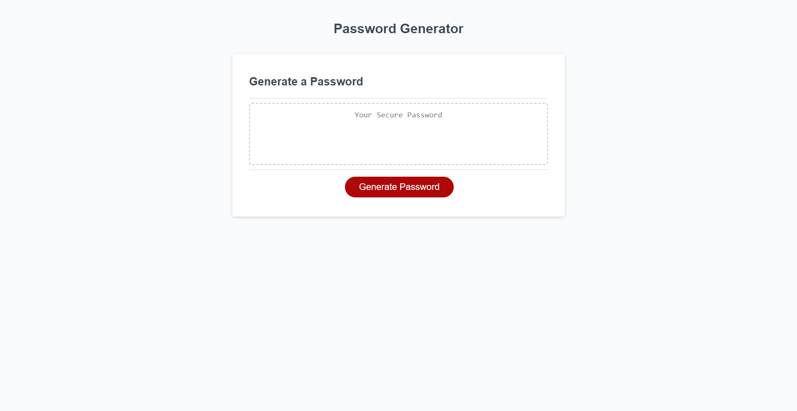
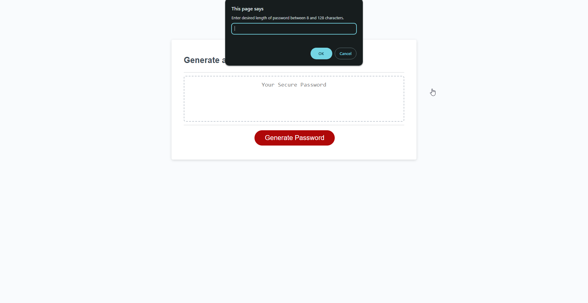
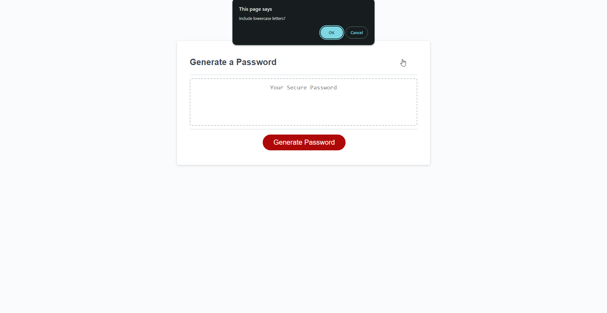
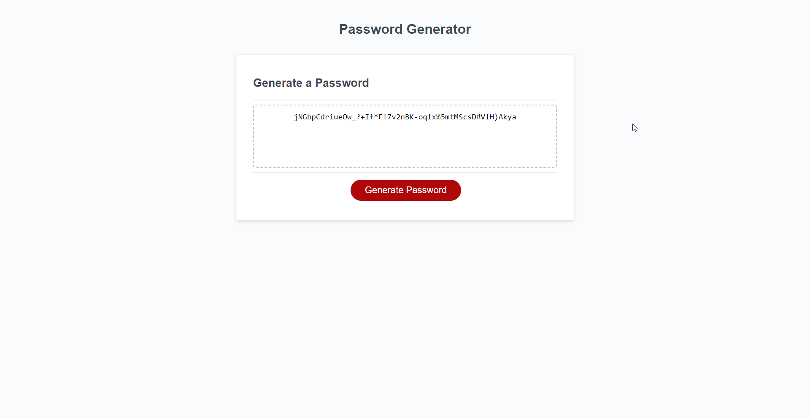

# Password Generator

## Description

This website randomly generates passwords within a set of parameters defined by the user. Users can specify a password length between 8 and 128 characters, and decide whether or not they want the password to incluce lowercase characters, uppercase characters, numbers, and special characters.

This website was built to serve as a convenient and fast way to generate random passwords. Having a secure, complex password with multiple character types is extremely important for keeping your personal accounts and data safe while on the internet. So, this website is a great tool to get a randomly-generated password of sufficient length and character variety to ensure your accounts will be secure.

In undertaking the project of making this generator, I learned a lot about building a complicated javaScript function that dynamically includes or excludes certain data based on user input. I initially struggled with accounting for all permutations of the user prompts, before realizing that I could utilize other javaScript array methods in order to make a much more succinct function.

This project greatly helped me become familiar with understanding which variables I would need to identify and how I would need to alter those variables to get the end result of a randomly generated password. I also became very familiar with using window prompts and alerts, saving the responses of those prompts, and using those responses to build a tool that outputs the desired value while still being user-friendly and simple.

## Installation

N/A

## Usage

To view this webpage, enter the URL [https://eaeidsath.github.io/Password-Generator/](https://eaeidsath.github.io/Password-Generator/) into any browser.

To use the password generator, click the 'Generate Password" button.

When the prompt appears, type in the desired length of your password between 8 and 128 characters.

The following 4 prompts will ask whether you want your password to include lowercase characters, uppercase characters, numbers, and special characters. On these prompts, click "Ok" to include the corresponding character type, or "Cancel" to exclude the character type. You must select "Ok" to at least one of the character types in order to successfully generate a password.

Once the prompts have been answered, the randomly generated password will appear in the text box.

Select and copy the text in the box and paste it wherever you want to use your new password.

If you enter a password length outside the bounds of 8-128, or if you do not select "Ok" to any of the character type prompts, you will be given an error message followed by a prompt asking if you want to start over. Click "Ok" on this prompt to start the generation process again, or click "Cancel" to exit the prompt without generating a password.

### Screenshots

## Credits

Evelyn Eidsath [https://github.com/eaeidsath](https://github.com/eaeidsath)

Xander Rapstine [https://github.com/Xandromus](https://github.com/Xandromus)

Tutorials:

Source referenced for converting array to uppercase (script.js line 3): [https://stackoverflow.com/questions/29719329/convert-array-into-upper-case](https://stackoverflow.com/questions/29719329/convert-array-into-upper-case)

Source referenced for pulling more than one random element from an array (script.js lines 48-49, 56-57): [https://stackoverflow.com/questions/19269545/how-to-get-a-number-of-random-elements-from-an-array](https://stackoverflow.com/questions/19269545/how-to-get-a-number-of-random-elements-from-an-array)